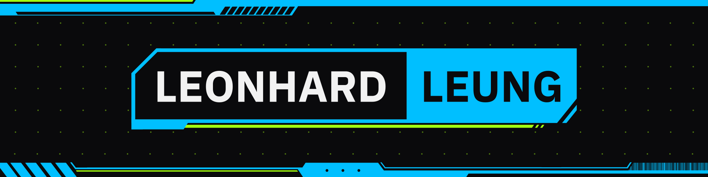

  

<h2 align="center">ABOUT ME</h2>

  <strong>Human developer. Professional tinkerer. Occasional bug creator. Packaged all-in-one</strong>

  I enjoy building things from scratch, taking them apart, figuring out how they work, and occasionally wondering why I though building them was a good idea in the first place.

  I am particularly interested in AI, software engineering, and systems development, but I'm not exactly picky about which rabbit hole I fall into. If something looks interesting, I'll
  probably end up trying to build it, tear it apart, or learn how it works.

  I especially enjoy understanding what's happening under the hood. Building something myself is one of my favorite ways to learn. Theory can explain how everytihng works, but
  there's something magical about turning a thought into a reality. Whether it's a database engine, an AI system, or some completely unnecessary side project that 
  started with a simple but powerful <em>"I wonder if I can..."</em>, I'd rather build it and find out.

  And no, I don't build absolutely everything from scratch. I have nothing against libraries, frameworks, APIs, or other people's hard work. In fact, I use them quite happily.
  I just like knowing what they're doing underneath all the complexity when I have the chance to find out. Reinventing the wheel is for the love of the game, but I'm not trying
  to manufacture my own tires before driving to the mall.

<table align="center">
  <tr>
    <td bgcolor="#000000">
      <strong>
        
          ARTIFICIAL INTELLIGENCE · SOFTWARE ENGINEERING · SYSTEMS ENGINEERING
        
      </strong>
    </td>
  </tr>
</table>

  <em>
    "Telling a programmer there's already a library to do X is like telling a songwriter there's already a song about love."
  </em>
   
  — Pete Cordell

<h2 align="center">TECH STACK</h2>

### Languages
<table>
  <tr>
    <td align="center">
      
       
      <strong>Python</strong>
    </td>
    <td align="center">
      
       
      <strong>Rust</strong>
    </td>
    <td align="center">
      
       
      <strong>Java</strong>
    </td>
    <td align="center">
      
       
      <strong>C#</strong>
    </td>
    <td align="center">
      
       
      <strong>JavaScript</strong>
    </td>
    <td align="center">
      
       
      <strong>TypeScript</strong>
    </td>
    <td align="center">
      
       
      <strong>Kotlin</strong>
    </td>
  </tr>
</table>

### AI / ML
<table>
  <tr>
    <td align="center">
      
       
      <strong>PyTorch</strong>
    </td>
    <td align="center">
      
       
      <strong>NumPy</strong>
    </td>
  </tr>
</table>

### Web Development
<table>
  <tr>
    <td align="center">
      
       
      <strong>HTML5</strong>
    </td>
    <td align="center">
      
       
      <strong>CSS3</strong>
    </td>
    <td align="center">
      
       
      <strong>React</strong>
    </td>
    <td align="center">
      
       
      <strong>Node.js</strong>
    </td>
  </tr>
</table>

### Mobile Development
<table>
  <tr>
    <td align="center">
      
       
      <strong>Gradle</strong>
    </td>
  </tr>
</table>

### Cloud / Backend
<table>
  <tr>
    <td align="center">
      
       
      <strong>Firebase</strong>
    </td>
  </tr>
</table>

### Tools
<table>
  <tr>
    <td align="center">
      
       
      <strong>Git</strong>
    </td>
    <td align="center">
      
       
      <strong>GitHub</strong>
    </td>
    <td align="center">
      
       
      <strong>Figma</strong>
    </td>
    <td>
      
       
      <strong>Unity</strong>
    </td>
    <td>
      
       
      <strong>JetBrains</strong>
    </td>
  </tr>
</table>

<h2 align="center">CURRENTLY LEARNING</h2>

- Backend Development
- React / Modern Frontend Development
- RAG systems
- Agentic AI
- LLM Application Development
- DevOps

<h2 align="center">INTERESTS</h2>

- Game Development and of course, Video Games
- Artificial Intelligence, more on other stuff and not purely chatbots
- Systems Programming
- Machine Learning
- Building Software From Scratch

  

